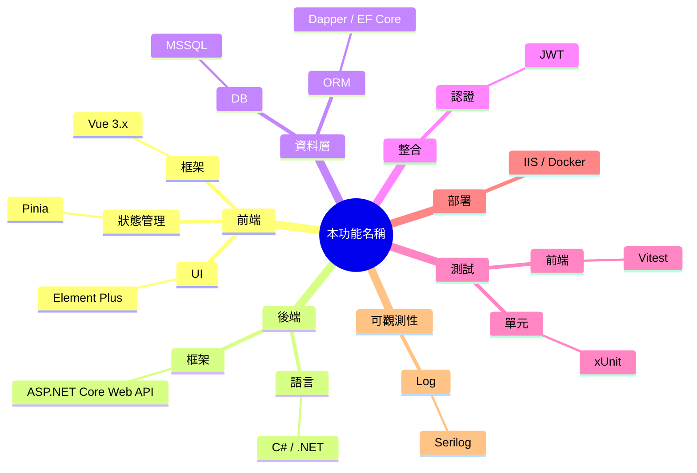

# Implementation Plan: [FEATURE]

**Branch**: `[###-feature-name]` | **Date**: [DATE] | **Spec**: [link]
**Input**: Feature specification from `/specs/[###-feature-name]/spec.md`

> 所有內容請以**繁體中文**撰寫，並明確記錄主要技術候選方案、最終採用方案，以及採用/捨棄的理由。

**Note**: This template is filled in by the `/speckit.plan` command. See `.specify/templates/plan-template.md` for the execution workflow.

## 目錄 *(mandatory)*

<!--
  ACTION REQUIRED: 依本檔案實際 Markdown 標題（`##`、`###`、`####` …）逐層產生精要條列式目錄，**層級不限制**。
  - 每一行對應一個標題，使用 `-` 條列；每層縮排 2 個空白。
  - 條目使用同檔錨點連結：`[標題文字](#標題文字)`（GFM 自動 slug：移除標點、空白轉 `-`、英文轉小寫）。
  - 「目錄」與「技術樹（心智圖）」兩個區塊本身**也要**列入目錄。
  - 文件內容若新增/移除/重排標題，必須同步更新此目錄。
-->

- [技術樹（心智圖）](#技術樹心智圖-mandatory)
- [Summary](#summary)
- [Technical Decision Log](#technical-decision-log)
- [Technical Context](#technical-context)
- [Constitution Check](#constitution-check)
- [Project Structure](#project-structure)
  - [Documentation (this feature)](#documentation-this-feature)
  - [Source Code (repository root)](#source-code-repository-root)
- [Complexity Tracking](#complexity-tracking)

## 技術樹（心智圖） *(mandatory)*

<!--
  ACTION REQUIRED: 以**心智圖**呈現本功能會應用到的所有技術節點，根節點為本 feature 名稱。
  - 主要分支建議涵蓋（依實際情況增刪）：前端、後端、資料層、整合/外部服務、測試、部署/CI、可觀測性、安全。
  - 每個葉節點寫具體技術名稱與版本（例如 `Vue 3.4` / `EF Core 8` / `MSSQL 2019` / `Vitest`）。
  - 同時提供「Mermaid 心智圖」與「條列式 fallback」兩種表達；任一渲染器無法支援 mermaid 時仍可閱讀。
-->



條列式 fallback（與上方 mermaid 內容同步）：

- 根：本功能名稱
  - 前端
    - 框架：Vue 3.x
    - 狀態：Pinia
    - UI：Element Plus
  - 後端
    - 語言：C# / .NET
    - 框架：ASP.NET Core Web API
  - 資料層
    - DB：MSSQL
    - ORM：Dapper / EF Core
  - 整合：JWT
  - 測試：xUnit、Vitest
  - 部署：IIS / Docker
  - 可觀測性：Serilog

## Summary

[Extract from feature spec: primary requirement + technical approach from research]

## Technical Decision Log

| 決策面向 | 評估方案 | 採用方案 | 採用理由 |
|----------|----------|----------|----------|
| 架構模式 | [列出至少 2 個可行方案] | [最終選擇] | [依現有程式庫、維護性、風險、交付速度說明] |
| 資料流/整合方式 | [候選方案] | [最終選擇] | [選擇原因] |
| 測試策略 | [候選方案] | [最終選擇] | [選擇原因] |
| 部署/執行模式 | [候選方案] | [最終選擇] | [選擇原因] |

## Technical Context

<!--
  ACTION REQUIRED: Replace the content in this section with the technical details
  for the project. The structure here is presented in advisory capacity to guide
  the iteration process.
-->

**Language/Version**: [e.g., Python 3.11, Swift 5.9, Rust 1.75 or NEEDS CLARIFICATION]  
**Primary Dependencies**: [e.g., FastAPI, UIKit, LLVM or NEEDS CLARIFICATION]  
**Storage**: [if applicable, e.g., PostgreSQL, CoreData, files or N/A]  
**Testing**: [e.g., pytest, XCTest, cargo test or NEEDS CLARIFICATION]  
**Target Platform**: [e.g., Linux server, iOS 15+, WASM or NEEDS CLARIFICATION]
**Project Type**: [e.g., library/cli/web-service/mobile-app/compiler/desktop-app or NEEDS CLARIFICATION]  
**Performance Goals**: [domain-specific, e.g., 1000 req/s, 10k lines/sec, 60 fps or NEEDS CLARIFICATION]  
**Constraints**: [domain-specific, e.g., <200ms p95, <100MB memory, offline-capable or NEEDS CLARIFICATION]  
**Scale/Scope**: [domain-specific, e.g., 10k users, 1M LOC, 50 screens or NEEDS CLARIFICATION]

## Constitution Check

*GATE: Must pass before Phase 0 research. Re-check after Phase 1 design.*

[Gates determined based on constitution file]

## Project Structure

### Documentation (this feature)

```text
specs/[###-feature]/
├── plan.md              # This file (/speckit.plan command output)
├── research.md          # Phase 0 output (/speckit.plan command)
├── data-model.md        # Phase 1 output (/speckit.plan command)
├── quickstart.md        # Phase 1 output (/speckit.plan command)
├── contracts/           # Phase 1 output (/speckit.plan command)
└── tasks.md             # Phase 2 output (/speckit.tasks command - NOT created by /speckit.plan)
```

### Source Code (repository root)
<!--
  ACTION REQUIRED: Replace the placeholder tree below with the concrete layout
  for this feature. Delete unused options and expand the chosen structure with
  real paths (e.g., apps/admin, packages/something). The delivered plan must
  not include Option labels.
-->

```text
# [REMOVE IF UNUSED] Option 1: Single project (DEFAULT)
src/
├── models/
├── services/
├── cli/
└── lib/

tests/
├── contract/
├── integration/
└── unit/

# [REMOVE IF UNUSED] Option 2: Web application (when "frontend" + "backend" detected)
backend/
├── src/
│   ├── models/
│   ├── services/
│   └── api/
└── tests/

frontend/
├── src/
│   ├── components/
│   ├── pages/
│   └── services/
└── tests/

# [REMOVE IF UNUSED] Option 3: Mobile + API (when "iOS/Android" detected)
api/
└── [same as backend above]

ios/ or android/
└── [platform-specific structure: feature modules, UI flows, platform tests]
```

**Structure Decision**: [Document the selected structure and reference the real
directories captured above]

## Complexity Tracking

> **Fill ONLY if Constitution Check has violations that must be justified**

| Violation | Why Needed | Simpler Alternative Rejected Because |
|-----------|------------|-------------------------------------|
| [e.g., 4th project] | [current need] | [why 3 projects insufficient] |
| [e.g., Repository pattern] | [specific problem] | [why direct DB access insufficient] |
