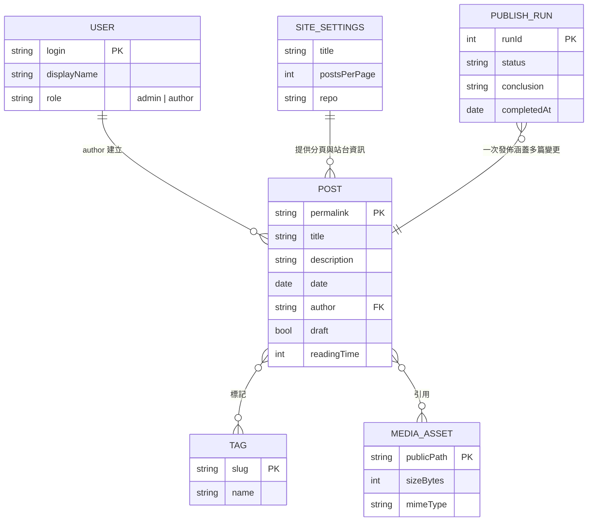

# Phase 1 資料模型：有後台可編輯、可快速部屬的部落格網站

**Feature**: `specs/001-admin-editable-blog` | **Date**: 2026-08-13
**Spec**: [spec.md](./spec.md) | **Research**: [research.md](./research.md)

## 目錄

- [模型總覽](#模型總覽)
- [文章 Post](#文章-post)
  - [欄位定義](#欄位定義)
  - [狀態轉移](#狀態轉移)
  - [驗證規則](#驗證規則)
- [標籤 Tag](#標籤-tag)
- [使用者 User](#使用者-user)
- [媒體資產 MediaAsset](#媒體資產-mediaasset)
- [站台設定 SiteSettings](#站台設定-sitesettings)
- [發佈作業 PublishRun](#發佈作業-publishrun)
- [實體關係](#實體關係)

## 模型總覽

本專案**沒有資料庫**。所有實體都以 Git 倉庫中的檔案或 GitHub 平台物件承載：

| 實體 | 實際載體 | 可寫入者 |
|---|---|---|
| 文章 Post | `src/posts/*.md`（front matter + Markdown 內文） | CMS 後台、直接改檔 |
| 標籤 Tag | 文章 front matter 的 `tags` 陣列（無獨立檔案） | 隨文章寫入 |
| 使用者 User | GitHub 倉庫協作者清單與角色 | 倉庫管理員（GitHub 介面） |
| 媒體資產 MediaAsset | `src/uploads/*` 二進位檔 | CMS 後台 |
| 站台設定 SiteSettings | `src/_data/site.js` | 直接改檔（v1 不開放後台編輯） |
| 發佈作業 PublishRun | GitHub Actions workflow run（唯讀查詢） | 系統自動產生 |

---

## 文章 Post

### 欄位定義

| 欄位 | 型別 | 必填 | 說明 | 對應需求 |
|---|---|---|---|---|
| `title` | string | ✅ | 文章標題 | FR-009、FR-024 |
| `description` | string | ✅ | 摘要，用於列表頁與 SEO | FR-009、FR-025 |
| `date` | date (ISO 8601) | ✅ | 發佈日期，決定列表排序 | FR-009、FR-025 |
| `author` | string | ✅ | 建立者的 GitHub 帳號；由 CMS 於建立時寫入 | FR-008 |
| `draft` | boolean | ✅ | `true` 為草稿，建置期排除 | FR-010～FR-012 |
| `tags` | string[] | ✅ | 必含 `post`；其餘為使用者標籤 | FR-017、FR-018 |
| `permalink` | string | ✅ | 公開網址，格式 `/posts/{slug}/` | FR-014 |
| `readingTime` | number | ✅ | 預估閱讀分鐘數 | — |
| `coverImage` | string | ✅ | 封面圖路徑，可留空 | FR-021 |
| `coverImageAlt` | string | ✅ | 封面圖替代文字 | FR-021 |
| 內文 | Markdown | ✅ | front matter 之後的正文 | FR-009 |

> `tags` 中的 `post` 是 Eleventy 收集文章用的標記，**不可省略**（沿用第一版部落格的既有慣例）；CMS 設定中以隱藏預設值自動帶入，作者不需自行輸入。

範例：

```markdown
---
title: 從零開始：用後台寫出第一篇文章
description: 記錄這個部落格的後台是怎麼運作的。
date: 2026-08-13
author: aloo31124
draft: false
tags:
  - post
  - 筆記
permalink: /posts/2026-08-13-first-post/
readingTime: 5
coverImage: /uploads/2026-08-13-cover.png
coverImageAlt: 後台編輯畫面的截圖
---

正文從這裡開始。
```

### 狀態轉移

狀態由 **`draft` 欄位** 與 **entry 所在的 Git 位置** 共同決定（詳見 [research.md R5](./research.md#r5-草稿待審核已發佈的狀態模型)）：

```text
        ┌──────────────────────────────────────────────┐
        │                                              │
        ▼                                              │
   ┌─────────┐   送出審核    ┌──────────┐   管理員核可   ┌───────────┐
   │  草稿    │ ───────────▶ │  待審核   │ ────────────▶ │  已發佈    │
   │draft:true│              │ PR 開啟中 │               │draft:false│
   │         │ ◀─────────── │          │               │已合併 main │
   └─────────┘   管理員退回   └──────────┘               └───────────┘
        ▲                                                     │
        └─────────────────────────────────────────────────────┘
                    下架（draft 改回 true，再走一次審核合併）
```

| 轉移 | 觸發者 | 實際動作 | 對應需求 |
|---|---|---|---|
| 新建 → 草稿 | 作者／管理員 | 在 `cms/posts/{slug}` 分支建立檔案，`draft: true` | FR-009、FR-010 |
| 草稿 → 待審核 | 作者／管理員 | entry 狀態改為 ready，PR 標記待審 | FR-007 |
| 待審核 → 已發佈 | **僅管理員** | 合併 PR 到 `main`，`draft: false` | FR-005、FR-007 |
| 待審核 → 草稿 | 管理員 | 退回並附說明，PR 保持開啟 | FR-007 |
| 已發佈 → 草稿（下架） | 作者（送審）／管理員（核可） | `draft` 改為 `true`，合併後建置移除該頁 | FR-012 |
| 任一狀態 → 刪除 | 作者（自己的）／管理員 | 刪除檔案，需二次確認 | FR-013 |

### 驗證規則

以下規則由 `scripts/check-content.mjs` 於建置期強制，任一項失敗即中止建置、不得取代線上版本（FR-032）：

| 規則 | 錯誤訊息方向 | 對應需求 |
|---|---|---|
| `title`、內文不得為空 | 指出缺少哪個欄位 | FR-024 |
| `permalink` 站內唯一 | 指出衝突的兩個檔名 | FR-014 |
| `permalink` 需符合 `/posts/{slug}/` 格式，slug 僅允許小寫英數與 `-` | 指出不合法字元 | FR-014 |
| `date` 需為合法日期 | 指出無法解析的值 | FR-009 |
| `tags` 必含 `post` | 提示會導致文章不出現在列表 | FR-018 |
| `draft` 必為布林值 | 避免 `"false"` 字串被判為真 | FR-010 |
| `coverImage` 若非空，檔案需存在於 `src/uploads/` | 指出找不到的路徑 | FR-021 |
| `src/uploads/` 內單檔 ≤ 5 MB 且副檔名合法 | 指出超標檔名與大小 | FR-020 |
| 建置產物 `_site` 內不得出現任何 `draft: true` 文章的路徑 | 指出洩漏的頁面 | FR-011 |

---

## 標籤 Tag

- **載體**：文章 front matter 的 `tags` 陣列，無獨立檔案；標籤集合由 Eleventy 於建置時彙整。
- **欄位**：`name`（顯示名稱，即陣列中的字串）、`slug`（用於網址，由名稱正規化產生）。
- **規則**：
  - 保留字 `post` 為系統標記，不列入公開標籤清單（FR-018）。
  - 僅為**至少含一篇已發佈文章**的標籤產生列表頁；草稿的標籤不得使外部產生新頁面（FR-011、FR-018）。
  - 標籤頁網址 `/tags/{slug}/`。
- **關係**：Post ↔ Tag 為多對多。

## 使用者 User

- **載體**：GitHub 倉庫的協作者與權限設定；本專案**不自建使用者資料表**。
- **欄位**：`login`（GitHub 帳號，即 Post 的 `author` 值）、`displayName`、`role`。
- **角色對應**：

  | 規格角色 | GitHub 權限 | 實際可做什麼 |
  |---|---|---|
  | 管理員 | 倉庫 Admin | 編輯任一文章、核可與合併 PR、調整協作者角色 |
  | 作者 | 倉庫 Write | 建立與編輯自己的文章、送出審核；無法直接合併到 `main` |

- **強制點**：`main` 分支保護規則 + `.github/CODEOWNERS`（詳見 [research.md R4](./research.md#r4-角色權限的真正強制點)）。角色調整在 GitHub 介面完成，v1 後台不提供使用者管理畫面。

## 媒體資產 MediaAsset

- **載體**：`src/uploads/` 下的二進位檔，隨文章一起進版控；建置時原樣複製到 `_site/uploads/`。
- **欄位**：`fileName`、`publicPath`（`/uploads/{fileName}`）、`sizeBytes`、`mimeType`、`altText`（記錄於引用它的文章中，非檔案本身）。
- **規則**：單檔 ≤ 5 MB；僅接受 `.jpg` `.jpeg` `.png` `.webp` `.gif` `.svg`；檔名建議以日期前綴避免碰撞（FR-020）。

## 站台設定 SiteSettings

- **載體**：`src/_data/site.js`。
- **欄位**：`title`、`description`、`author`、`url`、`postsPerPage`（預設 10，供 FR-025 分頁）、`repo`（`owner/name`，供發佈狀態列查詢 workflow run）。
- **v1 範圍**：不開放後台編輯，僅由倉庫直接修改（已記於 spec 的 Assumptions）。

## 發佈作業 PublishRun

- **載體**：GitHub Actions 的 workflow run，**唯讀**；本專案不自行儲存。
- **欄位**：`runId`、`status`（`queued` / `in_progress` / `completed`）、`conclusion`（`success` / `failure` / `cancelled`）、`startedAt`、`completedAt`、`htmlUrl`（供點入查看失敗原因）。
- **取得方式**：後台狀態列以未認證請求查詢公開倉庫最近一次 run（詳見 [research.md R6](./research.md#r6-發佈狀態回報fr-030)）。
- **對應需求**：FR-029～FR-031。

## 實體關係


