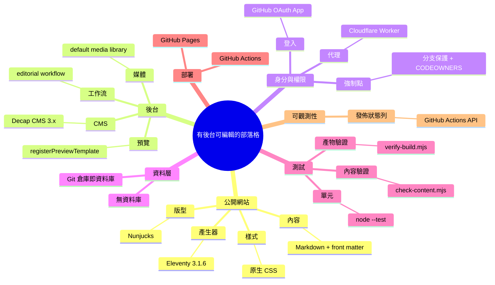

# Implementation Plan: 有後台可編輯、可快速部屬的部落格網站

**Branch**: `001-admin-editable-blog`（spec 目錄名；實際工作分支為 `main`） | **Date**: 2026-08-13 | **Spec**: [spec.md](./spec.md)
**Input**: Feature specification from `/specs/001-admin-editable-blog/spec.md`

> 所有內容以**繁體中文**撰寫，並明確記錄主要技術候選方案、最終採用方案，以及採用／捨棄的理由。

## 目錄 *(mandatory)*

- [技術樹（心智圖）](#技術樹心智圖-mandatory)
- [Summary](#summary)
- [Technical Decision Log](#technical-decision-log)
- [Technical Context](#technical-context)
- [Constitution Check](#constitution-check)
- [Project Structure](#project-structure)
  - [Documentation (this feature)](#documentation-this-feature)
  - [Source Code (repository root)](#source-code-repository-root)
- [實作順序](#實作順序)
- [Complexity Tracking](#complexity-tracking)

## 技術樹（心智圖） *(mandatory)*



條列式 fallback（與上方 mermaid 同步）：

- 根：有後台可編輯的部落格
  - 公開網站：Eleventy 3.1.6、Nunjucks 版型、Markdown 內容、原生 CSS
  - 後台：Decap CMS 3.x、editorial workflow、預覽樣板、預設媒體庫
  - 身分與權限：GitHub OAuth App、Cloudflare Worker 代理、分支保護 + CODEOWNERS
  - 資料層：無資料庫，Git 倉庫即資料庫
  - 測試：`check-content.mjs`、`verify-build.mjs`、`node --test`
  - 部署：GitHub Actions → GitHub Pages
  - 可觀測性：後台發佈狀態列（GitHub Actions API）

## Summary

把一個純靜態的 Eleventy 部落格，配上一個掛在 `/admin/` 的 Decap CMS 後台：站長與作者用 GitHub 帳號登入，在瀏覽器（含手機）寫 Markdown、上傳圖片、設標籤、存草稿；按下發佈後由 GitHub Actions 自動建置、驗證、部署到 GitHub Pages。

**三個設計支點**：

1. **Git 倉庫就是資料庫**——不引入資料庫與應用伺服器，內容即檔案，版本歷史天然存在。
2. **審核流程由 Git 原生機制承載**——Decap 的 editorial workflow 為每筆未發佈內容開一個 PR，配上 `main` 分支保護，作者的變更必須經管理員核可才會生效。這是 FR-006／FR-007 唯一有強制力的實作方式。
3. **驗證擋在部署之前**——沿用既有的 build → verify → deploy 順序，任何內容或產物違規都讓流程停在 verify，線上維持前一個成功版本。

唯一的額外基礎設施是一個 Cloudflare Worker OAuth 代理，且它**只影響後台登入，不影響讀者**。

## Technical Decision Log

| 決策面向 | 評估方案 | 採用方案 | 採用理由 |
|----------|----------|----------|----------|
| 靜態網站產生器 | Eleventy 3.1.6 / Astro / Next.js 靜態輸出 / Hugo | **Eleventy 3.1.6** | 既有 `deploy-pages.yml` 與 `verify-build.mjs` 已針對 `npm run build` → `_site` 撰寫，選它可零修改續用；被退版的第一版也是 Eleventy，版型可由 git 歷史取回。其餘方案會廢掉既有資產且對純文字部落格屬過度設計。 |
| 後台 CMS | Decap CMS / Sveltia CMS / Keystatic / PagesCMS | **Decap CMS 3.x** | **FR-007 的審核流程是決定性因素**：只有 Decap 現成提供 editorial workflow（每筆 entry 一個 PR）。Sveltia UX 更好但該功能尚未實作（列於 v1.0 前的待辦）；PagesCMS 無審核流程；Keystatic 與 Eleventy 整合度低。 |
| 登入與身分 | GitHub OAuth App + 自架 Worker / Netlify Git Gateway / PAT 手動貼權杖 | **GitHub OAuth App + Cloudflare Worker** | GitHub Pages 無伺服器端，Decap 的 GitHub backend 必須外掛一個提供 `/auth` 與 `/callback` 的代理，這是官方文件的標準做法。Git Gateway 需綁 Netlify，與沿用 Pages 的方向衝突；PAT 在 Decap 不支援且要使用者自行保管長期權杖。 |
| 角色權限強制點 | CMS 介面隱藏 / GitHub 分支保護 + CODEOWNERS | **GitHub 分支保護 + CODEOWNERS** | 靜態站在執行時沒有任何邏輯可檢查權限，介面隱藏只是「看不到」而非「做不到」。把強制點放在 GitHub，作者的變更只能停在 PR，合併權在管理員手上。 |
| 文章狀態模型 | 僅用 PR 分支表示草稿 / front matter `draft` 欄位 / 兩者並用 | **兩者並用** | 只靠 PR 分支的話，FR-012（已發佈文章下架）沒有對應動作；加上 `draft` 欄位後，下架就是把值改回 `true` 再走一次審核。Eleventy 端以 `permalink: false` 讓草稿**根本不產生檔案**，直接滿足 FR-011。 |
| 發佈狀態回報 | Actions 狀態徽章 / 查詢 Actions API 自製狀態列 | **自製狀態列** | 徽章只有成功／失敗兩態，看不到「進行中」與完成時間，無法完整滿足 FR-030。公開倉庫的 run 資訊可匿名查詢，實作成本低且與 CMS 解耦。 |
| 測試策略 | 瀏覽器 E2E（Playwright）/ 建置期驗證 + Node 內建測試 | **建置期驗證 + `node --test`** | 後台是第三方套件、登入需真實 OAuth，對個人部落格做瀏覽器 E2E 投報比極低。改把力氣放在「內容驗證 + 產物驗證」，正好也是 FR-032 要求的部署前閘門。 |
| 部署模式 | GitHub Pages（沿用）/ 改搬 Cloudflare Pages | **GitHub Pages（沿用）** | 既有 workflow 可直接用，免費且零維運。Cloudflare Pages 可讓 OAuth 與站台同源、少一個服務，列為日後若嫌 Worker 麻煩時的替代路線。 |

完整的候選比較與被否決的理由見 [research.md](./research.md)。

## Technical Context

**Language/Version**: Node.js 20+（ESM）
**Primary Dependencies**: `@11ty/eleventy` 3.1.6（建置期）、Decap CMS 3.x（瀏覽器端，以 script 載入）、`wrangler`（僅 OAuth Worker 部署用）
**Storage**: 無資料庫。內容為 `src/posts/*.md`，媒體為 `src/uploads/*`，皆存於 Git 倉庫
**Testing**: `node --test`（內建）、`scripts/check-content.mjs`（內容驗證）、`scripts/verify-build.mjs`（產物驗證，既有並擴充）
**Target Platform**: 公開網站為靜態 HTML/CSS，支援桌機與行動瀏覽器；後台為現代瀏覽器（含手機）
**Project Type**: 靜態網站 + 瀏覽器端後台（無應用伺服器）
**Performance Goals**: 文章頁在一般行動網路 2 秒內顯示正文（SC-007）；預覽於停止輸入 1 秒內更新（FR-022）；95% 的發佈 3 分鐘內上線（SC-003）
**Constraints**: 無伺服器端執行環境；公開網站不得含廣告、追蹤程式與第三方字型；單張圖片 ≤ 5 MB；GitHub API 未認證額度每 IP 每小時 60 次
**Scale/Scope**: 個人部落格規模，文章 < 1000 篇、作者數個位數；約 12 個頁面型別與 3 支腳本

## Constitution Check

*GATE: Must pass before Phase 0 research. Re-check after Phase 1 design.*

**本專案尚無已批准的憲章**——`.specify/memory/constitution.md` 不存在（`/speckit-constitution` 未曾執行）。因此改以規格自身的硬性約束作為閘門，並如實記錄此狀況，而非套用其他專案的樣板。

| 閘門 | Phase 0 前 | Phase 1 設計後 | 依據 |
|---|---|---|---|
| 不引入非必要的執行期服務 | ✅ | ✅ 僅 OAuth Worker 一項，且僅影響後台登入 | spec Assumptions |
| 沿用既有部署資產，不重寫 CI | ✅ | ✅ `deploy-pages.yml` 零修改 | 專案現況 |
| 部署前必須有自動驗證閘門 | ✅ | ✅ `check-content` + `verify-build` 皆在 deploy 之前 | FR-032 |
| 權限必須落在有強制力的那一層 | ⚠️ 待設計 | ✅ 分支保護 + CODEOWNERS，殘留缺口已記錄 | FR-006、FR-007 |
| 公開網站不得洩漏草稿 | ⚠️ 待設計 | ✅ `permalink: false` 不產檔 + 產物驗證掃描 | FR-011 |
| 不含廣告／追蹤／第三方字型 | ✅ | ✅ 後台 JS 僅在 `/admin/` 載入，讀者頁面不受影響 | spec Assumptions |

**結論**：無未經說明的違規；兩項「部分滿足」已列入 [Complexity Tracking](#complexity-tracking)。

**建議**：後續可執行 `/speckit-constitution` 為本專案建立正式憲章，讓之後的功能有一致的閘門依據。

## Project Structure

### Documentation (this feature)

```text
specs/001-admin-editable-blog/
├── plan.md              # 本檔（/speckit-plan 產出）
├── spec.md              # 需求規格（/speckit-specify 產出）
├── research.md          # Phase 0 產出
├── data-model.md        # Phase 1 產出
├── quickstart.md        # Phase 1 產出
├── contracts/           # Phase 1 產出
│   ├── content-schema.md    # front matter 與 CMS 設定契約
│   ├── site-routes.md       # 公開路由與建置產物契約
│   └── oauth-endpoints.md   # 登入代理與發佈狀態契約
├── checklists/
│   └── requirements.md  # 規格品質檢核表
└── tasks.md             # Phase 2 產出（/speckit-tasks，本命令不建立）
```

### Source Code (repository root)

```text
src/
├── _data/
│   └── site.js                  # 站台設定（標題、每頁篇數、repo）
├── _includes/layouts/
│   ├── base.njk                 # 共用外框
│   └── post.njk                 # 文章版型
├── admin/
│   ├── index.njk                # Decap 掛載頁 + 發佈狀態列
│   ├── config.yml               # CMS 設定（collections / media / editorial workflow）
│   └── preview.js               # 預覽樣板與樣式註冊（FR-022）
├── posts/
│   ├── posts.json               # 目錄層級預設值（layout、tags）
│   └── *.md                     # 文章
├── uploads/                     # 圖片上傳目的地（media_folder）
├── assets/styles.css
├── index.njk                    # 首頁 + 分頁
├── tags.njk                     # 標籤總覽與各標籤頁
├── about/index.njk
├── 404.njk
├── sitemap.njk
├── robots.njk
└── nojekyll.njk

scripts/
├── check-content.mjs            # 新增：front matter、slug 唯一性、圖片限制
├── verify-build.mjs             # 既有：擴充草稿外洩與 sitemap 檢查
├── Sync-Repository.ps1          # 既有：GitHub/GitLab 雙推
└── Sync-Repository.md           # 既有

infra/oauth-worker/              # 新增：Decap 登入用 OAuth 代理
├── src/index.js                 # /auth 與 /callback
├── wrangler.toml
└── package.json

test/
└── site.test.mjs                # 過濾器、草稿排除、標籤彙整、分頁

eleventy.config.js               # pathPrefix、集合、過濾器、passthrough
package.json                     # build / dev / test / verify
.github/
├── workflows/deploy-pages.yml   # 既有，零修改
└── CODEOWNERS                   # 新增：文章與媒體目錄需管理員核可
```

**Structure Decision**：採單一專案結構（非前後端分離），因為本功能沒有應用伺服器——後台是掛在同一個靜態站上的瀏覽器端應用。`infra/oauth-worker/` 獨立成一個目錄，是因為它部署到不同平台（Cloudflare）且有自己的相依與機密，不應與站台建置混在一起。`src/` 的版型與 `scripts/` 的驗證腳本沿用被退版的第一版部落格（commit `3334c01`）之結構，可由 git 歷史取回再改寫。

## 實作順序

建議依 User Story 優先序切分，每一階段結束都應是可運作、可驗收的狀態：

| 階段 | 內容 | 對應 | 完成時可驗收 |
|---|---|---|---|
| 1 | Eleventy 骨架、版型、首頁／文章頁／關於／404／sitemap／robots，接上既有 workflow | US1、US2 | 網站上線，讀者讀得到文章 |
| 2 | Decap 掛載頁、`config.yml`、OAuth Worker，後台可登入並發文 | US1 | 後台發文端到端可用 |
| 3 | `draft` 欄位與建置期排除、`check-content.mjs`、擴充 `verify-build.mjs` | US3、FR-011 | 草稿不外洩，違規內容擋在部署前 |
| 4 | 標籤總覽與標籤頁、分頁、圖片上傳限制、行動版樣式 | US3、US4 | 讀者導覽完整 |
| 5 | 分支保護、CODEOWNERS、editorial workflow 驗證 | US5 | 作者送審、管理員核可流程成立 |
| 6 | 預覽樣板、發佈狀態列、未儲存提醒 | US6、FR-030 | 編輯體驗與發佈可觀測性到位 |

細部任務拆解由 `/speckit-tasks` 產出。

## Complexity Tracking

> 僅記錄 Constitution Check 中「部分滿足」而需要說明的項目。

| 項目 | 為何接受 | 較簡單的替代方案為何被否決 |
|-----------|------------|-------------------------------------|
| 作者仍可「提出」修改他人文章的 PR（FR-006 只擋得住生效） | 合併權在管理員手上，他人文章實際上改不動；GitHub 的協作模型無法在給予 Write 權限的同時禁止提出變更 | 改用 Fork + Open Authoring 可完全禁止，但作者體驗明顯變差（需自行 fork、同步上游），對個人部落格規模不成比例 |
| slug 唯一性只在建置期強制，非儲存前即時查重（FR-014） | slug 樣板含日期前綴已大幅降低碰撞；真的撞到時建置會硬性失敗且指出兩個檔名，線上不受影響 | 編輯期即時查重需自訂 Decap widget，等於自行維護一段 CMS 擴充碼，且會綁死在 Decap 上，破壞日後切換 Sveltia 的退路 |
| 工作階段逾期依賴 GitHub 端撤銷授權（FR-003 的「逾期」部分） | 登出即清除本機憑證，規格主體已滿足；個人部落格的風險可接受 | 改用 GitHub App 可取得 8 小時過期的權杖，但 Decap 的 GitHub backend 以 OAuth App 為主要路徑，改造成本高於效益 |
| 公開倉庫下草稿原文在 GitHub 可被讀取 | 草稿不會出現在網站上（規格要求的是公開網站），且個人部落格草稿多非機密 | 改 private 倉庫可解決，但 GitHub Pages 從 private 倉庫發佈需付費方案，與「免費快速部屬」的前提衝突；**此限制須讓使用者知情** |
